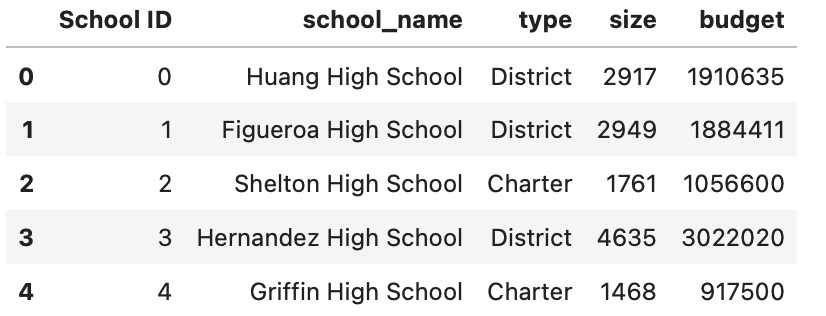
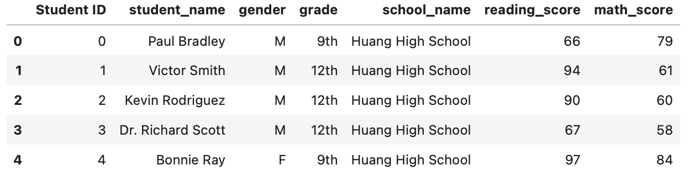
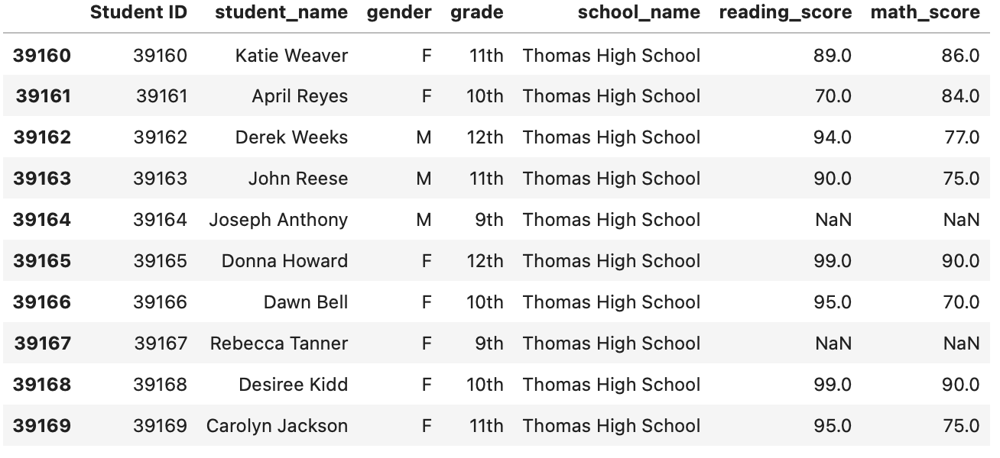
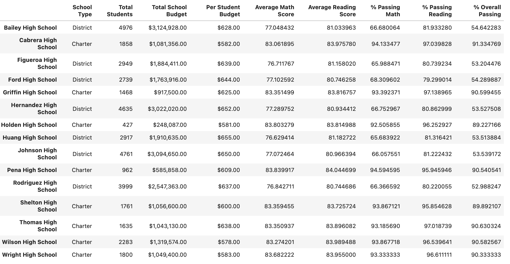
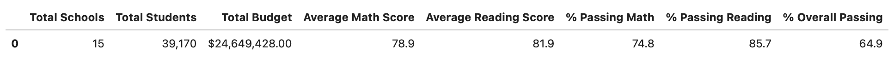
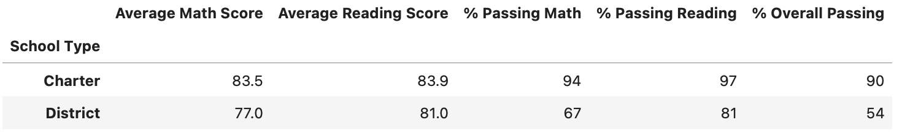
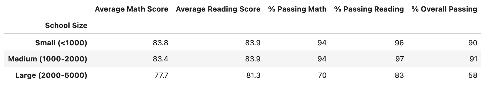

# School Disctrict Analysis 
## Overview of School District Analysis 
We are performing a data analysis over the information of schools and students in a School District City. We should obtain performance trends after the analysis. This analysis will help the student board in making decisions regarding the school budgets and priorities. The school dataset have columns with school id, school name, type of school, size and budget. 

    

  
The students dataset have columns with student id, student name, gender, grade, school name and the reading/math score.  

    

   

## Results 
After set the grades of Thomas High School 9th graders to NaN the school dataset looks like this:

 

    
As a result of this change the district summary and school summary have different values. 

 

    

 

    
If we look to the results by school type we can find that the Charter School type is a much better school where a big number of students pass both math and reading tests.   

 

    
Also the small-medium schools have better performance than larger schools. 

 

    

## Summary 
The percentages of passing math, passing reading and overall passing decreased very little after the changes in the grades of the 9th graders. In the other hand, the average reading score increased.  
* A priori   

 

  

* A posteriori

 

    